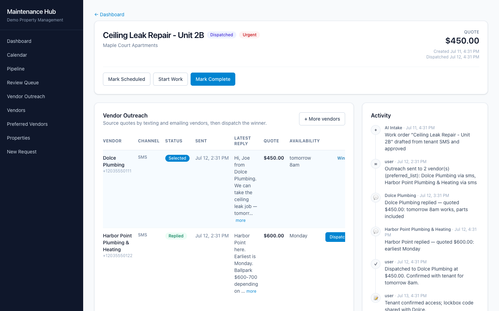

# Maintenance Hub

**AI maintenance intake and vendor dispatch for property-management firms.**

**Live demo:** https://maintenance-hub-pi.vercel.app (login `demo@maintenancehub.test` / `demo1234`, read-only snapshot)

A maintenance request comes in by text, calendar, or a manager typing it up. Maintenance Hub then:
1. turns it into a ticket,
2. finds the right vendors and asks them for quotes,
3. collects their replies into the ticket,
4. lets the property manager dispatch the job in one click.

It works alongside whatever property-management system a firm already uses. It doesn't replace it.



---

## The problem

At most property-management firms, a maintenance request means a manager re-typing a tenant's text into a ticket. Then they look up which plumber covers that town, text three vendors, and chase replies across their phone and inbox. Finally they compare quotes in their head. Maintenance Hub automates everything except the decision itself.

## How it works

### 1. Intake from three channels
- **SMS self-service.** A tenant or team member texts the firm's number with a description and photos. They get an automatic confirmation back.
- **Outlook calendar sync.** Maintenance events on a connected Outlook calendar are picked up automatically.
- **Manual entry.** A property manager creates a request directly.

All three go through the same pipeline.

### 2. AI classification and a review queue
AI reads each request and drafts a ticket. The draft includes the task, the trade (plumbing, HVAC, electrical…), and whether the job needs an outside **vendor Work Order**, the internal **field team**, or both. Drafts land in a **Review Queue** showing the AI's confidence and reasoning. A manager approves them (with edits if needed) or rejects them. Nothing becomes a real ticket without a human approving it.

### 3. Vendor sourcing
For a vendor job, Maintenance Hub builds a shortlist:
- the property's **preferred vendors** for that trade, if the firm has set them, or
- a lookup in the firm's vendor directory by **trade and service area**.

The manager can add or remove vendors before anything is sent.

### 4. Automated outreach
The platform sends each vendor on the shortlist a **text and/or email** about the job: what it is, the property and unit, photos, and a request for availability and a quote. Every message carries a `WO-<id>` reference.

### 5. Replies route back automatically
Vendor replies (SMS or email) are matched to the right work order by the reference, the vendor's phone, or the vendor's email. They land in that ticket's thread, not the intake queue. AI parses the **quote amount and availability** out of each free-text reply.

### 6. One-click dispatch
The manager compares the replies side by side and dispatches to one vendor. That records the vendor and quote, moves the work order to `dispatched`, and can notify the vendor. Internal jobs are assigned straight to a field-team member instead.

### 7. Tracking
- Each ticket has an **activity timeline**: created, approved, outreach sent, replies, dispatch, status changes, and notes.
- The portfolio **dashboard** and **pipeline board** show every open ticket across properties.
- The **Outreach Center** shows every pending vendor conversation in one place.
- The **Calendar** shows upcoming due dates.
- **Recurring task templates** (daily/weekly/monthly/yearly) create routine maintenance automatically.

## Screens

| | |
|---|---|
| Dashboard | Portfolio stats; Work Order / Field Team / Task tables; filters by property, status, search |
| Review Queue | AI drafts with confidence and reasoning; approve, edit, or reject |
| Work Order | Shortlist → send outreach → live vendor comparison → dispatch |
| Pipeline Board | Tickets by stage |
| Outreach Center | All vendor conversations awaiting reply |
| Calendar | Upcoming work by due date |
| Vendors / Preferred Vendors | Directory by trade and service area; preferred lists per property and trade |
| New Request | Manual intake and SMS conversation viewer |

Screenshots of each are in [`docs/screenshots/`](docs/screenshots/).

## Built for multiple firms

- Each customer firm is a separate **organization** with its own users, properties, vendors, and Twilio number. Inbound texts are routed to the right firm by the number they were sent to.
- Every query is scoped to the organization.
- Customer firms are set up by an admin. There's no public self-serve signup.

## Out of scope, on purpose

Maintenance Hub covers operations only. There is **no accounting**: no hours or expense logging, no bills or invoices, no payments, no QuickBooks or Buildium sync. Vendor outreach is text and email only (no AI voice calls). Tenants use SMS rather than a web portal. Billing for utilities is a separate product, [Metered](https://github.com/megresaut/metered-utility-billing).

## Tech

- **API:** Go (chi, pgx/v5, raw SQL), with migrations applied on boot.
- **Web:** React, TypeScript, Vite, Tailwind v4.
- **Database:** PostgreSQL.
- **AI:** OpenRouter (default) or Anthropic, for classification and quote parsing.
- **Messaging:** Twilio SMS, SMTP email, Microsoft Graph for Outlook.
- **Hosting:** Docker container with Postgres and Caddy, deployed via GitHub Actions (`deploy/ovh/`). The demo build is on Vercel.

---

## Setup

Requires Go, Node 20+, and PostgreSQL.

```bash
createdb maintenance_hub_local
# create api/.env with DATABASE_URL, JWT_SECRET, and OPENROUTER_API_KEY (or ANTHROPIC_API_KEY).
# Set OUTREACH_SIMULATE=1 to demo without Twilio/SMTP credentials.

cd api && go run ./cmd/server                       # :8091, runs migrations
go run ./cmd/provision -org "Demo PM" -email demo@maintenancehub.test \
  -password demo1234 -name "Demo Admin" -twilio "+15551234567"
cd .. && scripts/seed_demo.sh                       # sample properties and vendors
cd web && npm install && npm run dev                # http://localhost:5175
```

`scripts/verify_e2e.sh` runs the whole flow end to end: SMS → draft → approve → outreach → vendor reply → dispatch.

More detail: `FEATURE_PLAN.md` (product scope), `TECHNICAL_PLAN.md` (architecture), `DECISIONS.md` (build log), `deploy/ovh/README.md` (production deploy).
